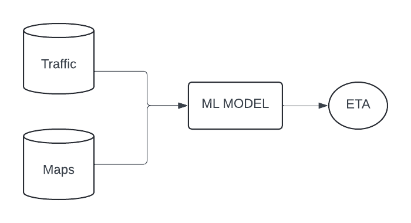

# Project Overview

This project predicts ETA for **Faras** trips using real-time data and machine learning to enhance service reliability, improve customer satisfaction, and optimize operations.

---

## Business Understanding

**Faras** operates in a competitive ride-hailing environment where real-time data and machine learning play a crucial role in providing reliable services. Accurately predicting the **Estimated Time of Arrival (ETA)** for trips enhances reliability, customer satisfaction, and overall business success.

Accurate ETAs are essential for optimizing operations such as fare calculations, driver-rider matching, and delivery planning. Inaccurate predictions can lead to cancellations, dissatisfaction, and revenue loss, making ETA prediction a critical part of Faras' business model.

### Key Benefits of Improved ETA Accuracy:
1. **Improved Customer Experience**: Accurate ETAs enable better trip planning and reduce cancellations.
2. **Higher Driver Satisfaction**: Drivers can optimize their earnings and manage their time more effectively.
3. **Revenue Growth**: Reliable ETAs foster customer loyalty, leading to increased ride bookings and business success.

---

## Data Understanding
**Data Source**  

The data is collected from a real-time traffic API and map services. It is streamed using Apache Spark, then fed into the model for processing and predictions.

