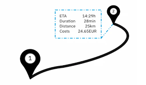

## Project Overview

This project aims to accurately predict the estimated time of arrival (ETA) for trips in the Faras ride-hailing app. By leveraging real-time data and machine learning algorithms, the solution improves service reliability and enhances customer satisfaction. Accurate ETA predictions will help Faras optimize operations, save costs, and allocate resources more efficiently, benefiting both customers and business partners.

## Business Understanding

In the competitive ride-hailing industry, providing accurate Estimated Time of Arrival (ETA) is crucial for enhancing customer satisfaction and optimizing business operations. Accurate ETAs help improve customer experience by reducing cancellations, frustrations, and providing realistic trip planning. For drivers, it allows better time management and maximizes their earnings, improving overall driver satisfaction. Inaccurate ETAs can result in customer churn, wasted resources, and negative reviews, impacting both revenue and the company's reputation.

The goal of this project is to develop an advanced predictive model that can deliver accurate, real-time ETAs for Faras trips. By improving ETA accuracy, Faras can enhance customer loyalty, reduce operational inefficiencies, and boost revenue, positioning itself competitively in the market.
